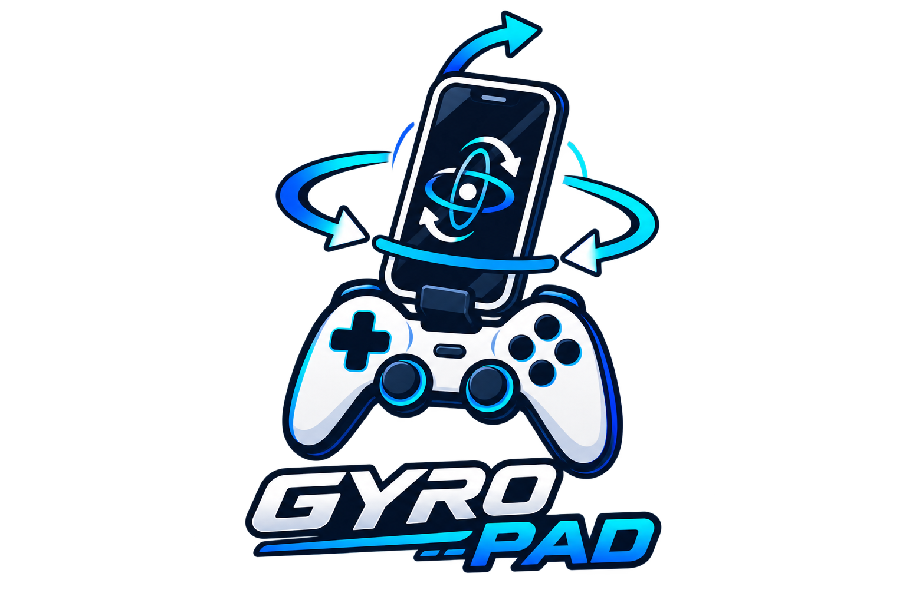

<p align="center">
  
</p>

<h1 align="center">GyroPad</h1>

<p align="center">
  Tambahkan gyro aiming ke gamepad Bluetooth yang tidak punya gyro, pakai sensor gyroscope HP kamu.
</p>

---

## Apa ini?

GyroPad lahir dari satu masalah kecil: gamepad Bluetooth murah (dites dengan **iPega
9076**) enak dipakai buat main Monster Hunter di PC — apalagi untuk gaya main
**HBG/LBG** — tapi tidak punya sensor gyro, padahal gyro aiming itu perbedaan
besar untuk akurasi bidik jarak jauh.

GyroPad memanfaatkan gyroscope yang sudah ada di HP kamu (project ini dites di
**Xiaomi Redmi A3**) sebagai sumber gyro tambahan, digabung dengan input dari
gamepad fisik, lalu dikirim ke PC lewat WiFi (atau USB via ADB) sebagai satu
virtual Xbox 360 controller. Sebagai bonus, rumble dari game juga dikirim
BALIK ke HP — berguna kalau motor getar gamepad fisik kamu bermasalah.

```
[Gamepad iPega 9076] --Bluetooth HID--> [HP Android + GyroPad App]
                                              |  (baca stick/tombol + gyro HP)
                                              |  gabung jadi satu state
                                              v
                                   WiFi (UDP) atau USB (adb reverse, TCP)
                                              v
                                   [PC: GyroPad Server (Python)]
                                              |
                                              v
                                   ViGEmBus -> Virtual Xbox 360 Controller
                                              v
                                        Game (mis. Monster Hunter)
                                              |
                                              | (rumble dari game)
                                              v
                                   [PC: GyroPad Server] -- rumble --> [HP bergetar]
```

Lihat [docs/ARCHITECTURE.md](docs/ARCHITECTURE.md) untuk penjelasan lebih detail.

## Status project

🚧 **Early prototype / work in progress.** Ini kerangka dasar (baseline) yang
sudah bisa jalan end-to-end, tapi belum banyak dipoles: kalibrasi gyro, UI,
dan mapping tombol masih sangat bisa dikembangkan. Kontribusi & eksperimen
dipersilakan.

Sudah dites dengan:
- Gamepad: iPega 9076 (Bluetooth HID standar)
- HP: Xiaomi Redmi A3
- PC: Windows + ViGEmBus

Gamepad Bluetooth HID generik lain kemungkinan besar juga jalan, karena
GyroPad membaca lewat Android `MotionEvent`/`KeyEvent` standar, bukan API
khusus vendor.

## Struktur repo

```
gyropad/
├── android/     # Aplikasi Android (Kotlin) - baca gamepad + gyro, kirim/terima ke PC
├── pc/          # Server PC (Python) - terima data, emulasi virtual Xbox controller, kirim rumble
└── docs/
    ├── ARCHITECTURE.md   # Kenapa didesain begini
    ├── PROTOCOL.md       # Spesifikasi paket data (state & rumble)
    ├── SETUP_ANDROID.md  # Build & pasang app
    ├── SETUP_PC.md       # Setup server
    └── SETUP_ADB.md      # Setup mode USB
```

## Fitur

- Baca stick/trigger/tombol dari gamepad Bluetooth HID fisik (dites iPega 9076)
- Gyro-aim pakai sensor gyroscope HP, hold-to-aim lewat tombol L1
- Dua mode koneksi ke PC: **WiFi (UDP)** atau **USB via ADB (TCP)**
- **Rumble feedback dari game ke HP** — pengganti motor getar gamepad yang rusak/tidak ada
- Crosshair kalibrasi di dalam app buat merasakan sensitivitas gyro sebelum masuk game

## Quick start

1. **PC**: siapkan server dulu, lihat [docs/SETUP_PC.md](docs/SETUP_PC.md).
2. **Android**: build & pasang app, lihat [docs/SETUP_ANDROID.md](docs/SETUP_ANDROID.md).
3. Pilih mode koneksi:
   - **WiFi**: pastikan HP & PC satu jaringan WiFi.
   - **USB**: ikuti [docs/SETUP_ADB.md](docs/SETUP_ADB.md) buat setup `adb reverse`.
4. Pairing gamepad iPega 9076 ke HP lewat Bluetooth seperti biasa.
5. Buka app GyroPad, pilih mode, isi IP/Port, tekan **Hubungkan**.
6. Tahan L1 di gamepad untuk aktifkan gyro-aim sementara membidik — lihat
   panel crosshair di app buat kalibrasi sensitivitas.

## Format data (protocol)

Detail lengkap paket JSON dua arah (state HP→PC, rumble PC→HP) ada di
[docs/PROTOCOL.md](docs/PROTOCOL.md).

## Roadmap / ide pengembangan

- [ ] Ganti JSON dengan format biner supaya latency lebih rendah
- [ ] Kalibrasi & auto-recenter gyro yang lebih canggih (mis. deteksi diam)
- [ ] UI mapping tombol yang bisa dikustomisasi
- [ ] Simpan profil sensitivitas per-game
- [ ] Dukungan Linux (uinput) selain ViGEmBus/Windows
- [ ] Overlay HUD sungguhan di layar PC (bukan cuma preview di app HP)

## Kontribusi

Pull request & issue sangat diterima, terutama untuk pengujian dengan gamepad
lain, penyesuaian sensitivitas gyro, dan optimasi latency.

## Lisensi

Lihat [LICENSE](LICENSE).
